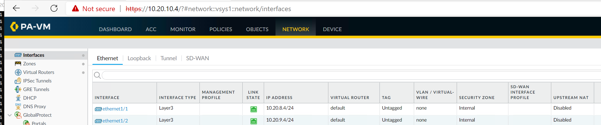

# Deploying a non-integrated NVA in vWAN without VXLAN and a transit VNET

## Description

In this solution Azure Virtual WAN was used together with a non-integrated Virtual WAN firewall that doesn't support VXLAN endpoints (VNIs) in Azure.

This solution was tested with Palo Alto VM series firewalls in single instance and HA (active/passive) scenarios.

> You can also deploy it using scale set (VMSS), but you need to predefine all possible BGP sessions.
> In case of using VMSS please make sure that you start/stop BGP sessions correct to avoid network connectivity loss during Scale-Up or Scale-Down.

## Architecture

The Virtual WAN was deployed in West Europe and Australia East. Each Hub has an ExpressRoute Connection to on premisis.

In this example the firewall is running in a separate VNET and Virtual WAN Routes are using to send traffic to the NVA.
A separate AVS VNET is used to transit the traffic to AVS. This is required as the traffic should go through the VM before it reaches AVS.

A PDF version is also available [here](images/architecture1.pdf).

A Visio version is available [here](images/architecture1.vsdx)

## Route Advertisement

You can advertise default routes using this solution, but you also need to advertise private IP address ranges to access the management network of AVS. This is because AVS management network does not accept default routes.

## Detailed Configuration

### Virtual WAN

Virtual WAN was deployed with two hubs, one in West Europe and one in Australia ist.
The Default Route table for both hubs was implemented like this:

| Route Name | Prefix | NextHop | Connection |
| --- | --- | --- | --- |
| EMEA | 10.20.0.0/16 | 10.20.4.4 | emea_conn |
| EMEA_AVS | 10.120.0.0/21 | 10.20.4.4 | emea_conn |
| AUSTRALIA | 10.32.0.0/16 | 10.32.4.4 | australia_conn |
| AUSTRALIA_AVS | 10.132.0.0/21 | 10.32.4.4 | australia_conn |

This route table will send local traffic to the VM incl all traffic going to AVS.

> When using HCX and doing Gateway cutover make sure you also update the route table in Virtual WAN and on the "Internal" interface route table on the firewall.

### Firewall VNET

The firewalls are running in separate VNETs and are peered to Virtual WAN and all spoke VNETs including AVS transit VNET.

The firewall VNET for West Euorpe looks like this:

| Subnet | Prefix | Route Table | Description
| --- | --- | --- | --- |
| External | 10.20.4.0/24 | - | used for communication to Virtual WAN |
| Internal | 10.20.5.0/24 | internal-route-table | used for AVS traffic |
| Mgmt | 10.20.6.0/24 | - | used for management interface |
| Internet | 10.20.7.0/24 | internet-route-table | used for Internet traffic |

The "internal-route-table" has following settings defined:

* the gateway route propagation is set to "No"
* a route for each AVS prefix pointing to the load balancer or the VM in AVS Spoke VNET

The "internet-route-table" has these settings:

* the gateway route propagation is set to "No"

### AVS Spoke VNET

The AVS Spoke VNET for West Euorpe looks like this:

| Subnet | Prefix | Route Table | Description
| --- | --- | --- | --- |
| External | 10.20.8.0/24 | - | used for traffic to AVS |
| Internal | 10.20.9.0/24 | internal-route-table | used for traffic to Virtual WAN |
| Mgmt | 10.20.10.0/24 | - | used for management interface |
| GatewaySubnet | 10.20.11.0/27 | - | used for Virtual Network Gateway (ExpressRoute Gateway) |
| RouteServerSubnet | 10.20.11.32/27 | - | used for RouteServer |

The "internal-route-table" has following settings defined:

* the gateway route propagation is set to "No"
* a default route (0.0.0.0/0) to the load balancer or the VM in firewall hub VNET

For the Virtual Network Gateway (ExpressRoute Gateway) Ultra-Performance is recommended as you can enable FastPath feature.

### Firewall Configuration in Firewall VNET

Please follow the standard deployment guide for your firewall in Azure.
For VMSS please also contact for Palo Alto representitive for configuration.

In this test Palo Alto firewalls were used and these settings were required:

* on Network -> Interfaces -> Ethernet
  * set the virtual router to default
  * set the security zone
  * define fixed IP addresses for interfaces that require BGP (otherwise you can't define the BGP IP address)
  * set the Interface Type to "Layer3"
* on Network -> Virtual Routers -> default -> static routes
  * add a default route (0.0.0.0 -> 10.20.4.1)
  * add an avs-routing route (10.20.9.0/24 -> 10.20.5.1)
* on Network -> Virtual Routers -> default -> redistribution profile
  * create a profile with source-type "static" and destination "0.0.0.0/0"
  * set the "Redistribute" to "Redist"
* on Network -> Virtual Routers -> default -> BGP
  * Enable BGP
  * Set the Router ID (here 10.20.4.4)
  * Set AS Number (here 65101)
  * Check "Reject Default Route"
  * Check "Install Route"
  * add a peer group
    * name the peer group
    * add the firewalls of AVS Spoke VNET (here AS 65103 with 10.20.9.4) type EBGP
    * select the correct interface and the IP Address of the internal subnet
    * define the peer address
    * enable "Multi Hop" in "Connection Options"

The configuration is also available [here](hub-euw-fw-config.txt)

### Firewall Configuration in AVS Spoke VNET

Please follow the standard deployment guide for your firewall in Azure.
For VMSS please also contact for Palo Alto representitive for configuration.

In this test Palo Alto firewalls were used and these settings were required:

* on Network -> Interfaces -> Ethernet
  * set the virtual router to default
  * set the security zone
  * define fixed IP addresses for interfaces that require BGP (otherwise you can't define the BGP IP address)
  * set the Interface Type to "Layer3"
* on Network -> Virtual Routers -> default -> static routes
  * add a default route (0.0.0.0 -> 10.20.4.1)
  * add an avs-routing route (10.20.5.0/24 -> 10.20.8.1)
  * add a dedicated route to routeserver (10.20.11.32/27 --> 1.20.8.1)
  * add routes for private networks (e.g. 10.0.0.0/8 -> 10.20.9.1)
* on Network -> Virtual Routers -> default -> BGP
  * Enable BGP
  * Set the Router ID (here 10.20.8.4)
  * Set AS Number (here 65103)
  * Uncheck "Reject Default Route"
  * Check "Install Route"
  * add a peer group for hub firewall
    * name the peer group
    * add the firewalls of AVS Spoke VNET (here AS 65101 with 10.20.5.4) type EBGP
    * select the correct interface and the IP Address of the internal subnet
    * define the peer address
    * enable "Multi Hop" in "Connection Options"
  * add a peer group for route server
    * name the peer group
    * add the route server IP addresses (10.20.11.36 & 10.20.11.37 with AS 65515)
    * select the correct interface and the IP Address of the internal subnet
    * define the peer address
    * enable "Multi Hop" in "Connection Options"
  * In "Redist Rules" select "Allow Redistribute Default Route"

The configuration is also available [here](avs-euw-fw-config.txt)

### Route Server Config for AVS Spoke VNET

Please see attached some screenshots for route server config

## Appendix

### Screenshots hub fw

### Screenshots avs fw

