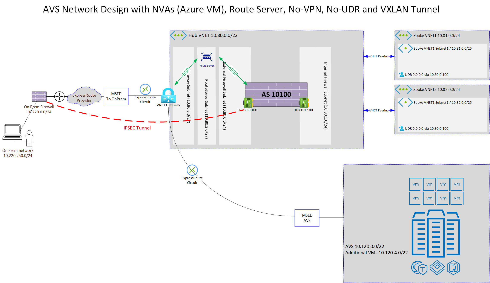
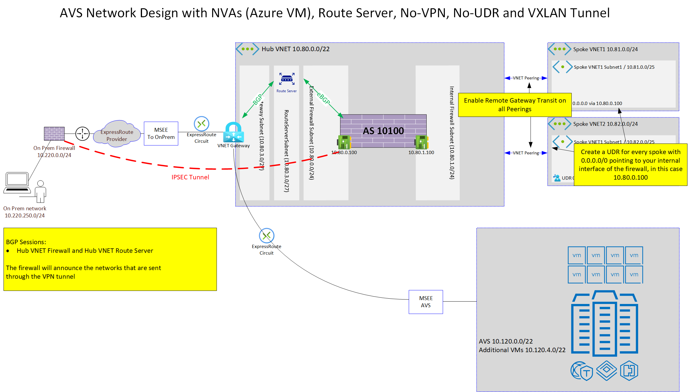
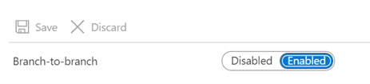
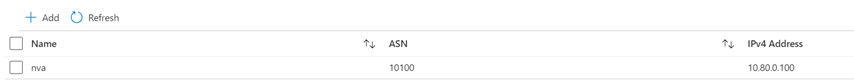

# Deploy NVAs in Azure with Route Server and VPN over ExpressRoute

## Description

When using IPSEC VPN over ExpressRoute the ExpressRoute connection will not announce the on-premises networks as they are hidden inside the VPN tunnel.
This gives the chance to use the same VNET Gateway as the firewall will announce the on-premises networks through the Route Server.



Traffic from on premises is going through the on premises firewall and gets encrypted. It is sent to the external interface of the NVA in Azure.
The firewall in Azure decrypts the packet and sends it through the internal interface to the VNET gateway, which will go to AVS.

When looking at the way back the traffic is going to the vNET Gateway and, as the firewall announces the on premsis traffic through BGP and the Route Server to the vNET Gateway, the traffic will go back to the firewall. Here it get's encrypted and is sent back to on premises.

> IMPORTANT
>
> do not announce the on premise networks in our on premesis ExpressRoute router

> IMPORTANT
>
> filter all routes that you get announced from Azure on your on premises router, otherwise you would get your on premisis routes from Azure as well.

A more detailed view describes the required settings on the vNETs and Subnets



## Detailed Configuration

Hub vNET Route Server Overview


Enable Branch-to-Branch for Route-Exchange


In "Peers" add your Hub NVA


After the deployment the Route Server should show information similar to this:

```cmd
C:\Users\phleiten>az network routeserver peering list-learned-routes -n nva --routeserver azcat-avs-nva-route-server -g azcat-avs-nva-hub-rg --query "RouteServiceRole_IN_0" -o table
LocalAddress    Network          NextHop      SourcePeer    Origin    AsPath       Weight
--------------  ---------------  -----------  ------------  --------  -----------  --------
10.80.3.4       10.82.0.0/24     10.80.0.100  10.80.0.100   EBgp      10100-10100  32768
10.80.3.4       10.81.0.0/24     10.80.0.100  10.80.0.100   EBgp      10100-10100  32768
10.80.3.4       10.80.0.0/22     10.80.0.100  10.80.0.100   EBgp      10100-10100  32768
10.80.3.4       10.220.0.0/24    10.80.0.100  10.80.0.100   EBgp      10100-10100  32768
10.80.3.4       10.80.0.0/24     10.80.0.100  10.80.0.100   EBgp      10100        32768
10.80.3.4       10.80.10.0/24    10.80.0.100  10.80.0.100   EBgp      10100        32768
10.80.3.4       10.80.1.0/24     10.80.0.100  10.80.0.100   EBgp      10100        32768
10.80.3.4       10.120.3.0/26    10.80.0.100  10.80.0.100   EBgp      10100-10100  32768
10.80.3.4       10.120.6.0/24    10.80.0.100  10.80.0.100   EBgp      10100-10100  32768
10.80.3.4       10.120.1.0/25    10.80.0.100  10.80.0.100   EBgp      10100-10100  32768
10.80.3.4       10.120.5.0/24    10.80.0.100  10.80.0.100   EBgp      10100-10100  32768
10.80.3.4       10.120.0.0/26    10.80.0.100  10.80.0.100   EBgp      10100-10100  32768
10.80.3.4       10.120.2.0/25    10.80.0.100  10.80.0.100   EBgp      10100-10100  32768
10.80.3.4       10.120.0.64/26   10.80.0.100  10.80.0.100   EBgp      10100-10100  32768
10.80.3.4       10.120.1.128/25  10.80.0.100  10.80.0.100   EBgp      10100-10100  32768
10.80.3.4       10.20.4.0/22     10.80.0.100  10.80.0.100   EBgp      10100-10100  32768
10.80.3.4       10.220.250.0/24  10.80.0.100  10.80.0.100   EBgp      10100        32768
10.80.3.4       10.220.9.4/30    10.80.0.100  10.80.0.100   EBgp      10100-10100  32768
10.80.3.4       10.220.9.0/30    10.80.0.100  10.80.0.100   EBgp      10100-10100  32768

C:\Users\phleiten>
```

### Hub NVA Configuration

```NVAconfig
avsnvahubfw # show router bgp
config router bgp
    set as 10100
    set router-id 10.80.0.100
    set ebgp-multipath enable
    config neighbor
        edit "10.80.3.4"
            set ebgp-enforce-multihop enable
            set soft-reconfiguration enable
            set remote-as 65515
            set route-map-in "as-path-replace"
        next
        edit "10.80.3.5"
            set ebgp-enforce-multihop enable
            set soft-reconfiguration enable
            set remote-as 65515
            set route-map-in "as-path-replace"
        next
    end
    config network
        edit 1
            set prefix 10.220.250.0 255.255.255.0
        next
    end
    config redistribute "connected"
        set status enable
    end
    config redistribute "rip"
    end
    config redistribute "ospf"
    end
    config redistribute "static"
    end
    config redistribute "isis"
    end
    config redistribute6 "connected"
    end
    config redistribute6 "rip"
    end
    config redistribute6 "ospf"
    end
    config redistribute6 "static"
    end
    config redistribute6 "isis"
    end
end
avsnvahubfw #
avsnvahubfw # show router aspath-list
config router aspath-list
    edit "aspath-list-1"
        config rule
            edit 1
                set action permit
                set regexp ".*"
            next
        end
    next
end

avsnvahubfw # show router route-map
config router route-map
    edit "as-path-replace"
        config rule
            edit 1
                set match-as-path "aspath-list-1"
                set set-aspath-action replace
                set set-aspath "10100"
                unset set-ip-nexthop
                unset set-ip6-nexthop
                unset set-ip6-nexthop-local
                unset set-originator-id
            next
        end
    next
end
```

Hub NVA info after deployment

```NVAinfo
avsnvahubfw # get router info bgp su
VRF 0 BGP router identifier 10.80.0.100, local AS number 10100
BGP table version is 5
7 BGP AS-PATH entries
1 BGP community entries

Neighbor   V         AS MsgRcvd MsgSent   TblVer  InQ OutQ Up/Down  State/PfxRcd
10.80.3.4  4      65515      81      88        4    0    0 01:07:37       15
10.80.3.5  4      65515      83      82        3    0    0 01:07:37       15

Total number of neighbors 2


avsnvahubfw # get router info bgp network
VRF 0 BGP table version is 5, local router ID is 10.80.0.100
Status codes: s suppressed, d damped, h history, * valid, > best, i - internal,
              S Stale
Origin codes: i - IGP, e - EGP, ? - incomplete

   Network          Next Hop            Metric LocPrf Weight RouteTag Path
*  10.20.4.0/22     10.80.3.4                0             0        0 10100 i <-/->
*>                  10.80.3.5                0             0        0 10100 i <-/1>
*  10.80.0.0/22     10.80.3.4                0             0        0 10100 i <-/->
*>                  10.80.3.5                0             0        0 10100 i <-/1>
*> 10.80.0.0/24     0.0.0.0                            32768        0 ? <-/1>
*> 10.80.1.0/24     0.0.0.0                            32768        0 ? <-/1>
*  10.81.0.0/24     10.80.3.4                0             0        0 10100 i <-/->
*>                  10.80.3.5                0             0        0 10100 i <-/1>
*  10.82.0.0/24     10.80.3.4                0             0        0 10100 i <-/->
*>                  10.80.3.5                0             0        0 10100 i <-/1>
*  10.120.0.0/26    10.80.3.4                0             0        0 10100 ? <-/->
*>                  10.80.3.5                0             0        0 10100 ? <-/1>
*  10.120.0.64/26   10.80.3.4                0             0        0 10100 ? <-/->
*>                  10.80.3.5                0             0        0 10100 ? <-/1>
*  10.120.1.0/25    10.80.3.4                0             0        0 10100 ? <-/->
*>                  10.80.3.5                0             0        0 10100 ? <-/1>
*  10.120.1.128/25  10.80.3.4                0             0        0 10100 ? <-/->
*>                  10.80.3.5                0             0        0 10100 ? <-/1>
*  10.120.2.0/25    10.80.3.4                0             0        0 10100 ? <-/->
*>                  10.80.3.5                0             0        0 10100 ? <-/1>
*  10.120.3.0/26    10.80.3.4                0             0        0 10100 ? <-/->
*>                  10.80.3.5                0             0        0 10100 ? <-/1>
*  10.120.5.0/24    10.80.3.4                0             0        0 10100 ? <-/->
*>                  10.80.3.5                0             0        0 10100 ? <-/1>
*  10.120.6.0/24    10.80.3.4                0             0        0 10100 ? <-/->
*>                  10.80.3.5                0             0        0 10100 ? <-/1>
*  10.220.0.0/24    10.80.3.4                0             0        0 10100 i <-/->
*>                  10.80.3.5                0             0        0 10100 i <-/1>
*  10.220.9.0/30    10.80.3.4                0             0        0 10100 i <-/->
*>                  10.80.3.5                0             0        0 10100 i <-/1>
*  10.220.9.4/30    10.80.3.4                0             0        0 10100 i <-/->
*>                  10.80.3.5                0             0        0 10100 i <-/1>
*> 10.220.250.0/24  0.0.0.0                       100  32768        0 i <-/1>

Total number of prefixes 17

avsnvahubfw #
```

