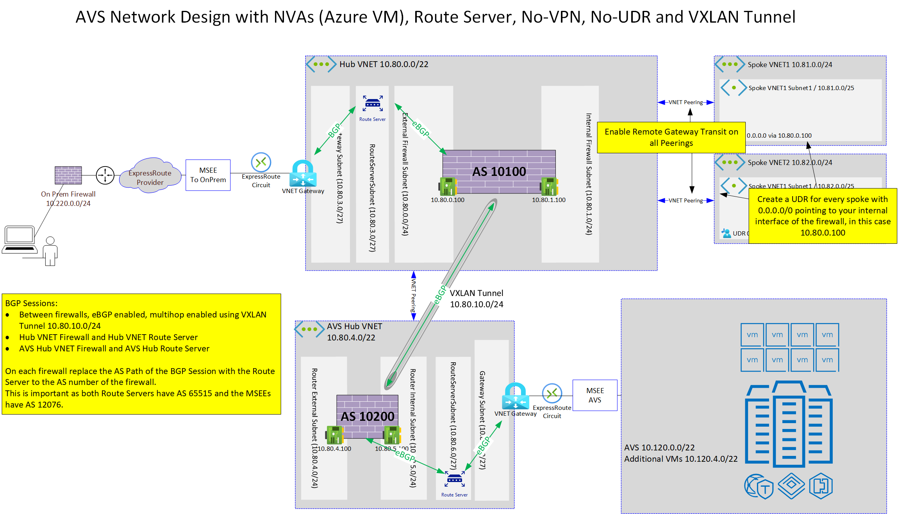

# Deploy NVAs that support VXLAN with Route Server and Transit VNET

## AVS on same VNET Gateway as other VNETs

As ExpressRoute and AVS both need to be connected to a VNET/ExpressRoute Gateway, the gateway would already know about the on-premises traffic as well as the AVS traffic.

To send the traffic from AVS through the VNET Gateway and the NVA to on-premises you would require a route on the Gateway Subnet to send the traffic to the NVA. The NVA would process the traffic and send it back to the Gateway Subnet as this is the direction for on premises traffic.
This would create a loop between the NVA and the VNET Gateway in the Gateway Subnet.


## Connecting AVS using a separate transit VNET

To successfully connect an AVS environment through NVA and ExpressRoute to on-premises without utilizing a VPN solution you need to create a different network architecture with a separate VNET Gateway for AVS. As only one VNET Gateway can be part of one VNET a separate VNET is required as well.


This scenario includes:

* Hub VNET (10.80.0.0/22)
  * Azure Route Server (10.80.3.4, 10.80.3.5) AS 65515
  * Hub Firewall that is connected to Route Server in Hub VNET using BGP (10.80.0.100, 10.80.1.100), AS 10100
* AVS Hub VNET (10.80.4.0/22)
  * Azure Route Server (10.80.6.4, 10.80.6.5), AS 65515
  * AVS Hub Firewall that is connected to Route Server in AVS Hub VNET using BGP (10.80.4.100, 10.80.5.100), AS 10200
* VXLAN Tunnel between the two firewalls
* eBGP Session between the two firewalls

The advantage of this scenario with the VXLAN tunnel is that there are no UDRs required, and the system automatically populates new routes without manual intervention.

Here a more detailed look at the scenario:



## Detailed Configuration

### Hub VNET Route Server Overview


Enable Branch-to-Branch for Route-Exchange


In Peers blade add your Hub NVA


### After Deployment infos Hub

```
C:\Users\phleiten>az network routeserver peering list-learned-routes -n nva --routeserver azcat-avs-nva-route-server -g azcat-avs-nva-hub-rg --query "RouteServiceRole_IN_0" -o table
LocalAddress    Network          NextHop      SourcePeer    Origin    AsPath             Weight
--------------  ---------------  -----------  ------------  --------  -----------------  --------
10.80.3.4       10.80.0.0/24     10.80.0.100  10.80.0.100   EBgp      10100              32768
10.80.3.4       10.80.10.0/24    10.80.0.100  10.80.0.100   EBgp      10100              32768
10.80.3.4       10.80.1.0/24     10.80.0.100  10.80.0.100   EBgp      10100              32768
10.80.3.4       10.80.4.0/22     10.80.0.100  10.80.0.100   EBgp      10100-10200-10200  32768
10.80.3.4       10.80.4.0/24     10.80.0.100  10.80.0.100   EBgp      10100-10200        32768
10.80.3.4       10.80.5.0/24     10.80.0.100  10.80.0.100   EBgp      10100-10200        32768
10.80.3.4       10.120.0.0/26    10.80.0.100  10.80.0.100   EBgp      10100-10200-10200  32768
10.80.3.4       10.120.6.0/24    10.80.0.100  10.80.0.100   EBgp      10100-10200-10200  32768
10.80.3.4       10.120.5.0/24    10.80.0.100  10.80.0.100   EBgp      10100-10200-10200  32768
10.80.3.4       10.120.3.0/26    10.80.0.100  10.80.0.100   EBgp      10100-10200-10200  32768
10.80.3.4       10.120.2.0/25    10.80.0.100  10.80.0.100   EBgp      10100-10200-10200  32768
10.80.3.4       10.120.1.128/25  10.80.0.100  10.80.0.100   EBgp      10100-10200-10200  32768
10.80.3.4       10.120.1.0/25    10.80.0.100  10.80.0.100   EBgp      10100-10200-10200  32768
10.80.3.4       10.120.0.64/26   10.80.0.100  10.80.0.100   EBgp      10100-10200-10200  32768

C:\Users\phleiten>az network routeserver peering list-advertised-routes -n nva --routeserver azcat-avs-nva-route-server -g azcat-avs-nva-hub-rg --query "RouteServiceRole_IN_0" -o table
LocalAddress    Network        NextHop    Origin    AsPath             Weight
--------------  -------------  ---------  --------  -----------------  --------
10.80.3.4       10.80.0.0/22   10.80.3.4  Igp       65515              0
10.80.3.4       10.81.0.0/24   10.80.3.4  Igp       65515              0
10.80.3.4       10.82.0.0/24   10.80.3.4  Igp       65515              0
10.80.3.4       10.220.0.0/24  10.80.3.4  Igp       65515-12076-64631  0
10.80.3.4       10.220.9.4/30  10.80.3.4  Igp       65515-12076-64631  0
10.80.3.4       10.220.9.0/30  10.80.3.4  Igp       65515-12076-64631  0

C:\Users\phleiten>
```

### Hub NVA

```config
avsnvahubfw # show router bgp
config router bgp
    set as 10100
    set router-id 10.80.0.100
    set ebgp-multipath enable
    config neighbor
        edit "10.80.3.4"
            set ebgp-enforce-multihop enable
            set soft-reconfiguration enable
            set remote-as 65515
            set route-map-in "as-path-replace"
        next
        edit "10.80.3.5"
            set ebgp-enforce-multihop enable
            set soft-reconfiguration enable
            set remote-as 65515
            set route-map-in "as-path-replace"
        next
        edit "10.80.10.2"
            set ebgp-enforce-multihop enable
            set soft-reconfiguration enable
            set remote-as 10200
        next
    end
    config redistribute "connected"
        set status enable
    end
    config redistribute "rip"
    end
    config redistribute "ospf"
    end
    config redistribute "static"
    end
    config redistribute "isis"
    end
    config redistribute6 "connected"
    end
    config redistribute6 "rip"
    end
    config redistribute6 "ospf"
    end
    config redistribute6 "static"
    end
    config redistribute6 "isis"
    end
end

avsnvahubfw #
avsnvahubfw # show router aspath-list
config router aspath-list
    edit "aspath-list-1"
        config rule
            edit 1
                set action permit
                set regexp ".*"
            next
        end
    next
end

avsnvahubfw # show router route-map
config router route-map
    edit "as-path-replace"
        config rule
            edit 1
                set match-as-path "aspath-list-1"
                set set-aspath-action replace
                set set-aspath "10100"
                unset set-ip-nexthop
                unset set-ip6-nexthop
                unset set-ip6-nexthop-local
                unset set-originator-id
            next
        end
    next
end

avsnvahubfw #show system vxlan
config system vxlan
    edit "vx1"
        set interface "port1"
        set vni 1000
        set remote-ip "10.80.4.100"
    next
end
avsnvahubfw # show system interface vx1
config system interface
    edit "vx1"
        set vdom "root"
        set ip 10.80.10.1 255.255.255.0
        set type vxlan
        set snmp-index 5
        set interface "port1"
    next
end
```

### Hub NVA info after deployment

```
avsnvahubfw # get router info bgp su
VRF 0 BGP router identifier 10.80.0.100, local AS number 10100
BGP table version is 9
6 BGP AS-PATH entries
1 BGP community entries

Neighbor   V         AS MsgRcvd MsgSent   TblVer  InQ OutQ Up/Down  State/PfxRcd
10.80.3.4  4      65515    1513    1528        7    0    0 16:35:38        7
10.80.3.5  4      65515    1506    1519        8    0    0 16:24:32        7
10.80.10.2 4      10200    1525    1518        7    0    0 21:44:48       12

Total number of neighbors 3


avsnvahubfw # get router info bgp network
VRF 0 BGP table version is 9, local router ID is 10.80.0.100
Status codes: s suppressed, d damped, h history, * valid, > best, i - internal,
              S Stale
Origin codes: i - IGP, e - EGP, ? - incomplete

   Network          Next Hop            Metric LocPrf Weight RouteTag Path
*>                  10.80.3.4                0             0        0 10100 i <-/1>
*  10.80.0.0/22     10.80.3.5                0             0        0 10100 i <-/->
*>                  10.80.3.4                0             0        0 10100 i <-/1>
*> 10.80.0.0/24     0.0.0.0                            32768        0 ? <-/1>
*> 10.80.1.0/24     0.0.0.0                            32768        0 ? <-/1>
*> 10.80.4.0/22     10.80.10.2               0             0        0 10200 10200 i <-/1>
*> 10.80.4.0/24     10.80.10.2               0             0        0 10200 ? <-/1>
*> 10.80.5.0/24     10.80.10.2               0             0        0 10200 ? <-/1>
*  10.80.10.0/24    10.80.10.2               0             0        0 10200 ? <-/->
*>                  0.0.0.0                            32768        0 ? <-/1>
*  10.81.0.0/24     10.80.3.5                0             0        0 10100 i <-/->
*>                  10.80.3.4                0             0        0 10100 i <-/1>
*  10.82.0.0/24     10.80.3.5                0             0        0 10100 i <-/->
*>                  10.80.3.4                0             0        0 10100 i <-/1>
*> 10.120.0.0/26    10.80.10.2               0             0        0 10200 10200 ? <-/1>
*> 10.120.0.64/26   10.80.10.2               0             0        0 10200 10200 ? <-/1>
*> 10.120.1.0/25    10.80.10.2               0             0        0 10200 10200 ? <-/1>
*> 10.120.1.128/25  10.80.10.2               0             0        0 10200 10200 ? <-/1>
*> 10.120.2.0/25    10.80.10.2               0             0        0 10200 10200 ? <-/1>
*> 10.120.3.0/26    10.80.10.2               0             0        0 10200 10200 ? <-/1>
*> 10.120.5.0/24    10.80.10.2               0             0        0 10200 10200 ? <-/1>
*> 10.120.6.0/24    10.80.10.2               0             0        0 10200 10200 ? <-/1>
*  10.220.0.0/24    10.80.3.5                0             0        0 10100 i <-/->
*>                  10.80.3.4                0             0        0 10100 i <-/1>
*  10.220.9.0/30    10.80.3.5                0             0        0 10100 i <-/->
*>                  10.80.3.4                0             0        0 10100 i <-/1>
*  10.220.9.4/30    10.80.3.5                0             0        0 10100 i <-/->
*>                  10.80.3.4                0             0        0 10100 i <-/1>

Total number of prefixes 20

avsnvahubfw #
```

### AVS Hub Route Server

AVS Hub VNET Route Server Overview


Enable Branch-to-Brach for Route-Exchange


In Peers blade add your Hub NVA


### Infos after deployment AVS Hub

```
C:\Users\phleiten>az network routeserver peering list-learned-routes -n route-nva --routeserver azcat-avs-nva-route-route-server -g azcat-avs-nva-route-rg --query "RouteServiceRole_IN_0" -o table
LocalAddress    Network        NextHop      SourcePeer    Origin    AsPath             Weight
--------------  -------------  -----------  ------------  --------  -----------------  --------
10.80.6.4       10.82.0.0/24   10.80.4.100  10.80.4.100   EBgp      10200-10100-10100  32768
10.80.6.4       10.81.0.0/24   10.80.4.100  10.80.4.100   EBgp      10200-10100-10100  32768
10.80.6.4       10.80.0.0/22   10.80.4.100  10.80.4.100   EBgp      10200-10100-10100  32768
10.80.6.4       10.80.0.0/24   10.80.4.100  10.80.4.100   EBgp      10200-10100        32768
10.80.6.4       10.80.1.0/24   10.80.4.100  10.80.4.100   EBgp      10200-10100        32768
10.80.6.4       10.80.4.0/24   10.80.4.100  10.80.4.100   EBgp      10200              32768
10.80.6.4       10.80.10.0/24  10.80.4.100  10.80.4.100   EBgp      10200              32768
10.80.6.4       10.80.5.0/24   10.80.4.100  10.80.4.100   EBgp      10200              32768
10.80.6.4       10.220.0.0/24  10.80.4.100  10.80.4.100   EBgp      10200-10100-10100  32768
10.80.6.4       10.220.9.4/30  10.80.4.100  10.80.4.100   EBgp      10200-10100-10100  32768
10.80.6.4       10.220.9.0/30  10.80.4.100  10.80.4.100   EBgp      10200-10100-10100  32768

C:\Users\phleiten>az network routeserver peering list-advertised-routes -n route-nva --routeserver azcat-avs-nva-route-route-server -g azcat-avs-nva-route-rg --query "RouteServiceRole_IN_0" -o table
LocalAddress    Network          NextHop    Origin      AsPath              Weight
--------------  ---------------  ---------  ----------  ------------------  --------
10.80.6.4       10.80.4.0/22     10.80.6.4  Igp         65515               0
10.80.6.4       10.120.1.0/25    10.80.6.4  Incomplete  65515-12076-398656  0
10.80.6.4       10.120.3.0/26    10.80.6.4  Incomplete  65515-12076-398656  0
10.80.6.4       10.120.2.0/25    10.80.6.4  Incomplete  65515-12076-398656  0
10.80.6.4       10.120.0.64/26   10.80.6.4  Incomplete  65515-12076-398656  0
10.80.6.4       10.120.5.0/24    10.80.6.4  Incomplete  65515-12076-398656  0
10.80.6.4       10.120.0.0/26    10.80.6.4  Incomplete  65515-12076-398656  0
10.80.6.4       10.120.6.0/24    10.80.6.4  Incomplete  65515-12076-398656  0
10.80.6.4       10.120.1.128/25  10.80.6.4  Incomplete  65515-12076-398656  0

C:\Users\phleiten>
```

### AVS Hub NVA

```
avsnvaroutefw # show router bgp
config router bgp
    set as 10200
    set router-id 10.80.4.100
    set ebgp-multipath enable
    config neighbor
        edit "10.80.6.4"
            set ebgp-enforce-multihop enable
            set soft-reconfiguration enable
            set remote-as 65515
            set route-map-in "as-path-replace"
        next
        edit "10.80.6.5"
            set ebgp-enforce-multihop enable
            set soft-reconfiguration enable
            set remote-as 65515
            set route-map-in "as-path-replace"
        next
        edit "10.80.10.1"
            set ebgp-enforce-multihop enable
            set soft-reconfiguration enable
            set remote-as 10100
        next
    end
    config redistribute "connected"
        set status enable
    end
    config redistribute "rip"
    end
    config redistribute "ospf"
    end
    config redistribute "static"
    end
    config redistribute "isis"
    end
    config redistribute6 "connected"
    end
    config redistribute6 "rip"
    end
    config redistribute6 "ospf"
    end
    config redistribute6 "static"
    end
    config redistribute6 "isis"
    end
end

avsnvaroutefw #
avsnvaroutefw # show router aspath-list
config router aspath-list
    edit "aspath-list-1"
        config rule
            edit 1
                set action permit
                set regexp ".*"
            next
        end
    next
end

avsnvaroutefw # show router route-map
config router route-map
    edit "as-path-replace"
        config rule
            edit 1
                set match-as-path "aspath-list-1"
                set set-aspath-action replace
                set set-aspath "10200"
                unset set-ip-nexthop
                unset set-ip6-nexthop
                unset set-ip6-nexthop-local
                unset set-originator-id
            next
        end
    next
end

avsnvaroutefw # show system vxlan
config system vxlan
    edit "vx2"
        set interface "port1"
        set vni 1000
        set remote-ip "10.80.0.100"
    next
end

avsnvaroutefw # show system interface vx2
config system interface
    edit "vx2"
        set vdom "root"
        set ip 10.80.10.2 255.255.255.0
        set type vxlan
        set snmp-index 5
        set interface "port1"
    next
end

avsnvaroutefw #
```

### AVS Hub NVA info after deployment

```
avsnvaroutefw # get router info bgp su
VRF 0 BGP router identifier 10.80.4.100, local AS number 10200
BGP table version is 7
6 BGP AS-PATH entries
1 BGP community entries

Neighbor   V         AS MsgRcvd MsgSent   TblVer  InQ OutQ Up/Down  State/PfxRcd
10.80.6.4  4      65515    1496    1506        5    0    0 12:43:05        9
10.80.6.5  4      65515    1498    1502        6    0    0 12:30:46        9
10.80.10.1 4      10100    1504    1511        5    0    0 21:51:56       10

Total number of neighbors 3


avsnvaroutefw # get router info bgp network
VRF 0 BGP table version is 7, local router ID is 10.80.4.100
Status codes: s suppressed, d damped, h history, * valid, > best, i - internal,
              S Stale
Origin codes: i - IGP, e - EGP, ? - incomplete

   Network          Next Hop            Metric LocPrf Weight RouteTag Path
*> 10.80.0.0/22     10.80.10.1               0             0        0 10100 10100 i <-/1>
*> 10.80.0.0/24     10.80.10.1               0             0        0 10100 ? <-/1>
*> 10.80.1.0/24     10.80.10.1               0             0        0 10100 ? <-/1>
*  10.80.4.0/22     10.80.6.5                0             0        0 10200 i <-/->
*>                  10.80.6.4                0             0        0 10200 i <-/1>
*> 10.80.4.0/24     0.0.0.0                            32768        0 ? <-/1>
*> 10.80.5.0/24     0.0.0.0                            32768        0 ? <-/1>
*  10.80.10.0/24    10.80.10.1               0             0        0 10100 ? <-/->
*>                  0.0.0.0                            32768        0 ? <-/1>
*> 10.81.0.0/24     10.80.10.1               0             0        0 10100 10100 i <-/1>
*> 10.82.0.0/24     10.80.10.1               0             0        0 10100 10100 i <-/1>
*  10.120.0.0/26    10.80.6.5                0             0        0 10200 ? <-/->
*>                  10.80.6.4                0             0        0 10200 ? <-/1>
*  10.120.0.64/26   10.80.6.5                0             0        0 10200 ? <-/->
*>                  10.80.6.4                0             0        0 10200 ? <-/1>
*  10.120.1.0/25    10.80.6.5                0             0        0 10200 ? <-/->
*>                  10.80.6.4                0             0        0 10200 ? <-/1>
*  10.120.1.128/25  10.80.6.5                0             0        0 10200 ? <-/->
*>                  10.80.6.4                0             0        0 10200 ? <-/1>
*  10.120.2.0/25    10.80.6.5                0             0        0 10200 ? <-/->
*>                  10.80.6.4                0             0        0 10200 ? <-/1>
*  10.120.3.0/26    10.80.6.5                0             0        0 10200 ? <-/->
*>                  10.80.6.4                0             0        0 10200 ? <-/1>
*  10.120.5.0/24    10.80.6.5                0             0        0 10200 ? <-/->
*>                  10.80.6.4                0             0        0 10200 ? <-/1>
*  10.120.6.0/24    10.80.6.5                0             0        0 10200 ? <-/->
*>                  10.80.6.4                0             0        0 10200 ? <-/1>
*> 10.220.0.0/24    10.80.10.1               0             0        0 10100 10100 i <-/1>
*> 10.220.9.0/30    10.80.10.1               0             0        0 10100 10100 i <-/1>
*> 10.220.9.4/30    10.80.10.1               0             0        0 10100 10100 i <-/1>

Total number of prefixes 21

avsnvaroutefw #
```

## Performance Test
After implementing this scenario you should test the latency and the performance using e.g. qperf or iperf. Please be aware that “ping” is not a good test tool as ICMP traffic is not prioritized on Azure. This could lead to wrong results.

The test was done using D4sv3 firewalls which were the limiting factor because of NICs able to run up to 2000 Mbit/s which equals the 217 Mbytes/s.


The number of VNET Gateways and firewalls can influence the latency and throughput of the environment.

It is strongly recommended to use Ultra Performance VNET Gateways and the FastPath feature.
